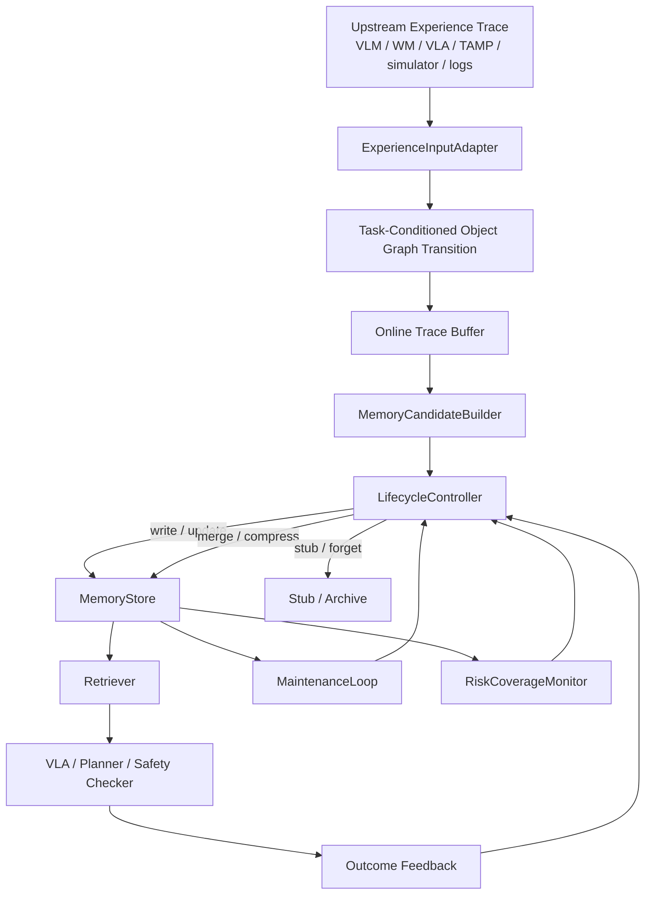

# Stage A: Memory Substrate Engineering Design

Date: 2026-04-24

This document turns the current memory modeling discussion into an implementable Stage A design. The goal is not to modify a VLA internally yet. The goal is to build a memory substrate that can ingest embodied experience, compress it into reusable intermediate representations, retrieve it for decisions, and safely forget low-value memories.

## 1. Scope

Stage A implements:

- upstream trace adaptation into task-conditioned object graph transitions
- experience projection from robot episodes or reasoning traces
- short-term memory buffering
- candidate memory construction
- consolidation into reusable memory items
- retrieval for downstream VLA / planner / safety modules
- background memory maintenance
- safe demotion, stubbing, and forgetting

### 1.1 Substrate Hypothesis

Stage A is based on the following substrate-first hypothesis:

> Embodied robot experience can be externalized into a structured,
> lifecycle-controlled memory substrate that supports immediate behavioral
> adaptation before being distilled into datasets, world models, or policy
> parameters.

The purpose of the substrate is not to replace a general embodied model.
Instead, it provides a low-cost intermediate layer for experience that would
otherwise remain scattered in raw logs or be absorbed only through expensive
model training.

In Stage A, this hypothesis is tested at the single-system substrate level:

- experience can be projected from episodes into reusable task / object /
  operation / embodiment-skill oriented memory units
- retrieved memory can improve decisions through constraints, action priors,
  risk warnings, or repair suggestions
- lifecycle control can keep memory useful under storage and retrieval budgets
- every memory item remains evidence-backed through pointers to source episodes,
  frame ranges, state traces, action traces, and outcomes

Fleet-level sharing, cluster aggregation, and cross-robot memory evolution are
important follow-up directions, but they are out of scope for this Stage A
implementation.

The current paper target is to prove that the memory substrate itself is useful:
it should improve decision quality, retrieval efficiency, consolidation quality,
and safety-relevant behavior without VLA fine-tuning. Safety is an important
evaluation setting in this paper, but a dedicated safety-memory paper can later
specialize the same substrate around failure boundaries, repair-guided
replanning, and unsafe-action reduction.

Stage A does not implement:

- perception model training
- attention injection into VLA
- VLA fine-tuning
- latent memory tokens
- full world model training
- end-to-end learned memory policies
- dataset export / labeling pipeline
- fleet-level memory aggregation
- cross-robot memory marketplace / synchronization

The output of Stage A is an external memory substrate with measurable decision value.

## 2. Runtime Graph



The system has two loops:

- online loop: handles new episodes and task-time retrieval
- maintenance loop: periodically evaluates existing memories for compression, demotion, stubbing, or deletion

## 3. IR Boundary

### 3.1 Upstream-to-Memory Input Boundary

Memory cannot decide what to store directly from raw pixels unless Stage A also
solves perception, world-model learning, and VLA reasoning. That is out of
scope. Stage A therefore defines an `ExperienceInputAdapter` boundary before
the memory substrate.

The adapter is not a perception model. It only normalizes whatever the upstream
system already provides into the memory input contract. After the Gemini video
pipeline smoke test, Stage A treats this contract as a noisy projected event,
not as ground-truth scene understanding:

\[
\hat{x}_t = I_{\phi}(\tau_{t:t+k}, g_t)
\]

where \(\tau_{t:t+k}\) is an upstream execution trace and \(I_{\phi}\) is a
replaceable projector. The upstream trace may come from VLM reasoning, a world
model, a VLA execution trace, a TAMP planner trace, simulator state, robot logs,
human annotation, or mocked synthetic data.

The memory input is a task-conditioned object graph transition:

\[
\boxed{
\hat{x}_t=(g_t,\;\hat{G}_t,\;a_t,\;\hat{G}'_t,\;\hat{y}_t,\;e_t,\;\eta_t)
}
\]

where:

- \(g_t\): task or subgoal
- \(\hat{G}_t=(\hat{V}_t,\hat{E}_t)\): projected task-relevant object graph before the action
- \(a_t\): operation / skill / VLA action
- \(\hat{G}'_t=(\hat{V}'_t,\hat{E}'_t)\): projected task-relevant object graph after the action
- \(\hat{y}_t\): projected outcome, including success, failure, risk, recovery, and cost
- \(e_t\): evidence pointers to frames, video slices, traces, embeddings, or logs
- \(\eta_t\): metadata, confidence, source, and embodiment context

This means Stage A stores task-oriented interaction experience, not raw visual
frames as memory by default. Raw frames remain evidence:

\[
e_i \rightarrow \text{episode id, frame range, sensor trace, state trace}
\]

The upstream boundary is intentionally replaceable. Better detectors, 3D
reconstruction, VLMs, learned world models, or direct VLA traces can improve
the quality of \(\hat{x}_t\) later without changing the memory lifecycle
objective.

### 3.2 Relation-First Spatial Memory

Stage A does not store dense spatial reconstruction by default. For memory,
the useful unit is usually not metric geometry:

\[
(x,y,z,\theta)
\]

but task-conditioned spatial relationship:

\[
\mathrm{rel}(o_i,o_j,\text{task},\text{operation})
\]

Examples:

- cup on table
- knife near target cup
- object inside drawer
- human close to robot workspace
- approach from right side is unsafe
- subgoal \(g_1\) completed before opening drawer

Metric geometry should be retained only when it changes a downstream decision:

- collision margin
- reachability
- grasp pose
- approach direction
- safety boundary
- planner constraint

Otherwise it should remain in the evidence trace, not in long-lived memory.

This gives the default storage rule:

\[
\text{store spatial information}
\quad \text{iff} \quad
\text{it changes future action, task progress, retrieval, or safety decision}
\]

Unobserved or currently invisible regions should not be hallucinated into
memory. They are represented as uncertainty:

\[
\text{unknown} / \text{occluded} / \text{stale}
\]

If a previously visible object becomes invisible, Stage A may keep a short-term
belief such as:

\[
\text{cup was-on table}, \quad \mathrm{confidence}=0.62, \quad
\mathrm{status}=\text{stale}
\]

but it should not maintain a full hidden-scene reconstruction unless the task
requires it.

### 3.3 Risk Relation Candidates

Upstream reasoning does not decide what is safe, what must be remembered, or what must
be protected from forgetting. Those decisions belong to the memory lifecycle
objective and the risk coverage constraint in Section 5.

The upstream adapter only passes risk-relevant relation candidates when they
are visible, inferred, or explicitly reported by the upstream trace. Examples:

- knife near grasp target
- hot object on planned path
- human close to robot workspace
- fragile object below carried object
- occluded region along planned trajectory

These candidates are ordinary graph edges or attributes inside \(\hat{G}_t\) and
\(\hat{G}'_t\). They are then passed to the memory lifecycle controller:

\[
r_t^{cand} \subset \hat{E}_t \cup \hat{E}'_t
\]

The lifecycle controller then decides whether they should be written, merged,
kept in short-term memory, compressed, stubbed, or discarded under the same
objective:

\[
\mathcal{J}(M,R)
\quad \text{subject to} \quad
\mathrm{Coverage}_{\text{risk}}(M)\ge \rho_{\min}
\]

This keeps the boundary clean:

- upstream reasoning extracts candidates and confidence
- the input adapter packages task-relevant evidence into the object graph transition
- memory lifecycle decides persistence, compression, retrieval protection, and forgetting

There is only one final authority for "store or not store":

\[
\mathcal{U}_{\text{life}}(M_t,c_t,\mathcal{C}_t,y_t)
\]

The input adapter or candidate builder may output \(\varnothing\) when no
meaningful event-level transition exists, but that is input sanitation, not a
memory lifecycle decision.

### 3.4 Task-Oriented IR Boundary

Stage A should not rely on a cost function to implicitly discover the full
structure of embodied experience from high-dimensional traces. If the system
had to learn which variables matter only from raw episodes and lifecycle
feedback, it would become an IR world-model training problem and would require
substantially more data.

Because embodied interaction data are scarce, Stage A constrains lifecycle
optimization to a human-specified TOOES conditioning schema rather than asking
the cost objective to learn a task-oriented IR world model from raw experience.

Instead, Stage A uses a semi-structured conditioning schema:

\[
\text{TOOES} = \text{Task} / \text{Object} / \text{Operation} /
\text{Embodiment} / \text{Skill}
\]

This schema is not a closed ontology and is not the full memory content. It is
the computable coordinate system used to index, compare, retrieve, consolidate,
and evaluate embodied experience.

The lifecycle objective then operates inside this coordinate system:

- TOOES defines the candidate space for similarity, transfer, support, risk, and
  abstraction
- the lifecycle objective decides what to write, merge, compress, stub, archive,
  or forget
- outcome feedback estimates whether a memory item has marginal decision value

This separates two responsibilities:

- explicit IR structure makes the substrate computable with limited data
- cost / utility control keeps the substrate adaptive instead of hand-curated

An IR world model may later be trained from validated substrate items, but that
is downstream of Stage A. Stage A should produce world-model-ready experience
items, not claim to learn a full world model.

## 4. Minimal Data Model

### 4.1 Episode

An episode is raw or semi-raw interaction data.

```python
Episode = {
    "episode_id": str,
    "task_id": str,
    "embodiment_id": str,
    "observations": list,
    "actions": list,
    "states": list,
    "outcome": dict,
    "timestamps": list,
    "metadata": dict,
}
```

The episode itself is not the long-term memory. It is evidence.

### 4.2 Experience Event

The experience event is the formal input to the memory substrate. It is a
task-conditioned object graph transition, not a raw frame, raw video, full world
state, or caption list. It is also not assumed to be ground truth. It is a
projected, confidence-bearing event produced by an upstream projector such as
the current Gemini video pipeline.

\[
\hat{x}_t=(g_t,\hat{G}_t,a_t,\hat{G}'_t,\hat{y}_t,e_t,\eta_t),
\quad \hat{G}_t=(\hat{V}_t,\hat{E}_t), \quad \hat{G}'_t=(\hat{V}'_t,\hat{E}'_t)
\]

```python
ExperienceEvent = {
    "event_id": str,
    "episode_id": str,
    "type": "transition_event",
    "goal": {
        "task": str,
        "subgoal": str | None,
    },
    "graph_before": {
        "nodes": list[dict],
        "edges": list[dict],
    },
    "action": {
        "action_id": str,
        "operator": str,
        "arguments": dict,
        "skill_pointer": str | None,
        "execution_summary": dict | None,
    },
    "graph_after": {
        "nodes": list[dict],
        "edges": list[dict],
    },
    "outcome": {
        "status": "success" | "failure" | "risk_avoided" | "recovery_success" | "near_miss",
        "task_progress": str | None,
        "risk": dict | None,
        "metrics": dict,
    },
    "evidence": {
        "keyframes": list[str],
        "video_slice": str | None,
        "trace": str | None,
        "embedding_refs": list[str],
    },
    "metadata": {
        "timestamp": float | str,
        "source": str,
        "confidence": dict | float,
        "missing_fields": list[str],
        "raw_caption": str | None,
        "embodiment_pointer": str,
        "scene_pointer": str | None,
    },
}
```

Nodes represent task-relevant objects, regions, agents, tools, skills, or
abstract task entities. Edges represent spatial relations, semantic relations,
affordances, constraints, risk relations, and action-object bindings.

```python
Confidence = {
    "value": float,
    "source": str,
    "calibration": str | None,
}

Node = {
    "id": str,
    "type": "object" | "region" | "agent" | "skill" | "task_entity" | "unknown",
    "category": str | None,
    "attributes": list[str],
    "task_role": list[str],
    "state": list[str],
    "raw_description": str | None,
    "confidence": float | Confidence,
    "evidence": list[str],
}

Edge = {
    "id": str,
    "source": str,
    "predicate": str,
    "target": str,
    "relation_type": "spatial" | "semantic" | "affordance" | "constraint" | "risk" | "manipulation" | "unknown",
    "degree": float | None,
    "raw_description": str | None,
    "confidence": float | Confidence,
    "evidence": list[str],
}
```

The schema is a working IR for indexing, comparison, retrieval, and lifecycle
control. It is not an ontological claim that the world is fully captured by
nodes and edges. When an upstream projector cannot reliably coerce an
observation into a node or edge, the adapter should preserve `raw_caption`,
`raw_description`, `missing_fields`, and evidence pointers instead of forcing a
false structured fact.

This object is not long-term memory. It is the event-level input that the
candidate builder may convert into memory-compatible IR.

### 4.3 Memory Candidate

The candidate builder converts an `ExperienceEvent` into memory-compatible
candidate IR. It does not decide long-term persistence.

\[
c_t = B_{\text{cand}}(\hat{x}_t)
\]

For v0, the builder extracts only task-useful transition content:

- task and subgoal context
- object / relation deltas between \(\hat{G}_t\) and \(\hat{G}'_t\)
- action signature and skill pointer
- outcome signature
- risk or repair signature when present
- evidence refs and projector confidence

```python
MemoryCandidate = {
    "candidate_id": str,
    "episode_id": str,
    "event_ref": str,
    "z": {
        "task_context": dict,
        "graph_delta": dict,
        "action_signature": dict,
        "outcome_signature": dict,
        "risk_signature": dict | None,
        "repair_signature": dict | None,
    },
    "e": {
        "evidence_refs": list[str],
    },
    "eta": {
        "confidence": dict,
        "source": str,
        "missing_fields": list[str],
    },
}
```

This is still candidate-level material. It becomes \(m_i=(z_i,e_i,c_i)\) only
after the lifecycle controller accepts a write or merge operation.

### 4.4 Memory Item

Longer-lived memory uses the minimal substrate contract:

\[
m_i=(z_i,e_i,c_i)
\]

Where:

- \(z_i\): representation / content payload
- \(e_i\): evidence pointer
- \(c_i\): lifecycle control state

The engineering object should preserve this separation.

```python
MemoryItem = {
    "memory_id": str,
    "z": {
        "payload": dict,
        "embedding": list[float] | None,
        "representation_type": str,
    },
    "e": {
        "evidence_refs": list[str],
    },
    "c": {
        "status": "active" | "consolidated" | "stub" | "archived",
        "created_at": float,
        "updated_at": float,
        "last_accessed_at": float | None,
        "access_count": int,
        "success_support": int,
        "failure_support": int,
        "risk_support": int,
        "decision_impact_score": float,
        "retrieval_cost": float,
        "storage_cost": float,
        "risk_lock": bool,
        "metadata": dict,
    },
}
```

The important design choice is that memory type is not hard-coded as ontology. The `z.payload` can later be learned, graph-based, symbolic, or hybrid. The `c` fields exist only to manage lifecycle decisions.

### 4.5 Stub

A stub is not a separate memory ontology. It is a demoted memory item:

\[
\mathrm{stub}(m_i)=(\tilde z_i,e_i,\tilde c_i)
\]

The full payload is compressed, but the evidence pointer and lifecycle control remain.

```python
MemoryStub = {
    "memory_id": str,
    "z": {
        "summary": str,
        "embedding": list[float] | None,
        "risk_marker": dict | None,
    },
    "e": {
        "evidence_refs": list[str],
        "archived_payload_ref": str | None,
    },
    "c": {
        "status": "stub",
        "restore_cost": float,
        "last_accessed_at": float | None,
        "access_count": int,
        "risk_lock": bool,
        "metadata": dict,
    },
}
```

Stub is not failure. It means the system intentionally keeps a low-cost, recoverable index instead of a full item. In the lifecycle, `MemoryItem -> MemoryStub -> archived/deleted`.

## 5. Core Objective

The lifecycle controller uses a local memory pressure objective:

\[
\mathcal{J}(M,R)
=
\alpha C_{\text{store}}(M)
+
\beta C_{\text{query}}(R \mid M)
-
\gamma U_{\text{act}}(M,R)
\]

subject to:

\[
\mathrm{Coverage}_{\text{risk}}(M)\ge \rho_{\min}
\]

Where:

- \(C_{\text{store}}\): memory size, index size, update cost, maintenance cost
- \(C_{\text{query}}\): retrieval latency, number of candidates, reranking cost, context injection cost
- \(U_{\text{act}}\): estimated benefit to task success, recovery, planning success, action accuracy, or risk avoidance
- \(\mathrm{Coverage}_{\text{risk}}\): coverage over a risk validation set or safety query set

This is not a claim of physical energy. It is an engineering decision function.

## 6. Operation Acceptance Rule

Every lifecycle operation proposes a new memory state:

\[
M' = o(M, x)
\]

where:

\[
o \in \{\text{write}, \text{update}, \text{merge}, \text{compress}, \text{stub}, \text{forget}\}
\]

Accept the operation only if:

\[
\Delta \mathcal{J}(o)
=
\widehat{\mathcal{J}}(M',R')
-
\widehat{\mathcal{J}}(M,R)
< 0
\]

and:

\[
\mathrm{Coverage}_{\text{risk}}(M')\ge \rho_{\min}
\]

If the risk constraint fails, the operation is rejected even if it saves storage or query cost.

## 7. Online Loop

The online loop runs when new embodied experience arrives.

### 7.1 Algorithm

\[
\hat{x}_t = I_{\phi}(\tau_{t:t+k},g_t)
\]

\[
\hat{x}_t=(g_t,\hat{G}_t,a_t,\hat{G}'_t,\hat{y}_t,e_t,\eta_t)
\]

\[
c_t = B_{\text{cand}}(\hat{x}_t)
\]

\[
\mathcal{C}_t = R(q_t, M_t)
\]

\[
M_{t+1} = \mathcal{U}_{\text{life}}(M_t, c_t, \mathcal{C}_t, y_t)
\]

Plain engineering version:

1. receive episode or episode chunk
2. normalize upstream trace into a task-conditioned object graph transition
3. build memory candidate from the experience event
4. retrieve related existing memories
5. update support statistics on retrieved memories
6. decide whether to write, merge, or ignore candidate
8. run risk coverage check before any destructive operation
9. return retrieved context to VLA / planner / safety checker
10. log outcome feedback for later utility estimation

### 7.2 Write Rule

Write a new memory when the candidate is not redundant and has estimated future value:

\[
\text{write}(c_t)
\quad \text{if} \quad
V(c_t) - C(c_t) > \tau_{\text{write}}
\]

where:

\[
V(c_t)
=
\lambda_s \Delta \text{success}
+
\lambda_a \Delta \text{action\_accuracy}
+
\lambda_p \Delta \text{planning}
+
\lambda_r \Delta \text{risk\_coverage}
+
\lambda_e \text{salience}
\]

This value can initially be heuristic. Later it can be learned.

### 7.3 Merge Rule

Merge a candidate with existing memories when it is redundant but strengthens an existing abstraction:

\[
\text{merge}(c_t,m_i)
\quad \text{if} \quad
\mathrm{sim}(c_t,m_i)>\tau_{\text{sim}}
\quad \land \quad
\Delta \mathcal{J}<0
\]

Merge should increase support counts and improve abstraction without losing evidence references.

### 7.4 Candidate to Consolidated Rule

A candidate becomes a consolidated substrate item if removing it would hurt decision quality:

\[
c_i \rightarrow \mathrm{ConsolidatedSubstrate}
\quad \text{if} \quad
\widehat{\mathcal{J}}(M \setminus c_i,R)
-
\widehat{\mathcal{J}}(M,R)
>
\tau_{\text{ltm}}
\]

This must be estimated through shadow ablation, replay, or validation tasks. Do not physically delete the candidate during the test.

## 8. Maintenance Loop

The maintenance loop handles memories already inside the store. It runs periodically or when resource pressure is high.

### 8.1 Trigger

Run maintenance when any condition holds:

\[
|M| > B_{\text{size}}
\]

\[
C_{\text{query}} > B_{\text{latency}}
\]

\[
C_{\text{store}} > B_{\text{storage}}
\]

\[
t - t_{\text{last\_maintenance}} > B_{\text{period}}
\]

The loop samples a batch:

\[
\mathcal{B}_t \subset M_t
\]

It should not scan the full memory every time.

### 8.2 Maintenance Pressure

For each existing memory \(m_i\), compute:

\[
P_i
=
\lambda_c C_i
+
\lambda_o O_i
+
\lambda_d D_i
+
\lambda_n N_i
-
\lambda_u U_i
-
\lambda_r R_i
\]

Where:

- \(C_i\): storage, retrieval, and context-injection cost
- \(O_i\): staleness or obsolescence
- \(D_i\): redundancy with other memories
- \(N_i\): noise or contradiction score
- \(U_i\): historical decision utility
- \(R_i\): risk coverage contribution

If:

\[
P_i > \tau_{\text{maintain}}
\]

then \(m_i\) enters the compression / stub / forget candidate queue.

## 9. Forgetting

Forgetting applies to existing memory, not only new input.

### 9.1 Shadow Ablation

Before forgetting, estimate:

\[
\Delta_i
=
\widehat{\mathcal{J}}(M \setminus m_i,R)
-
\widehat{\mathcal{J}}(M,R)
\]

If \(\Delta_i\) is small, the memory has low marginal value.

### 9.2 Forget Rule

\[
\text{forget}(m_i)
\quad \text{if} \quad
\Delta_i < \tau_{\text{forget}}
\quad \land \quad
\mathrm{Coverage}_{\text{risk}}(M \setminus m_i)\ge \rho_{\min}
\quad \land \quad
\text{shadow\_tests\_pass}(m_i)
\]

If the risk check fails:

\[
\text{forget}(m_i) = \text{reject}
\]

If utility is low but deletion is risky:

\[
m_i \rightarrow \text{risk-locked stub}
\]

### 9.3 Demotion Path

The default path is gradual:

\[
\text{active}
\rightarrow
\text{consolidated}
\rightarrow
\text{stub candidate}
\rightarrow
\text{stub}
\rightarrow
\text{archived / deleted}
\]

Direct deletion should be rare. First implementation should only support stubbing and archiving. Physical deletion can be added after evaluation is reliable.

## 10. Retrieval

Retrieval takes a query from VLA, planner, or safety monitor:

\[
q_t = (p^{obs}_t,g_t,a_{t-1},\pi_t,r_t)
\]

where:

- \(p^{obs}_t\): current observation summary or object graph query
- \(g_t\): task goal
- \(a_{t-1}\): recent action
- \(\pi_t\): planner state
- \(r_t\): risk state

Return:

\[
\mathcal{M}^{ctx}_t = R(q_t,M_t)
\]

The retrieved context should be small and actionable:

```python
RetrievedContext = {
    "relevant_memories": list[MemoryItem | MemoryStub],
    "risk_constraints": list,
    "action_priors": list,
    "repair_suggestions": list,
    "evidence_refs": list[str],
}
```

Stage A retrieval can be implemented as:

1. vector / key matching for candidate recall
2. symbolic or structured filtering
3. risk-priority reranking
4. top-k context packaging

## 11. Risk Coverage

Risk coverage is a hard constraint, not a soft reward.

Maintain a validation set:

```python
RiskQuery = {
    "query_id": str,
    "state_condition": dict,
    "action_condition": dict,
    "expected_block_or_warning": bool,
    "risk_type": str,
}
```

Coverage is:

\[
\mathrm{Coverage}_{\text{risk}}(M)
=
\frac{
\#\text{risk queries correctly covered by }M
}{
\#\text{risk queries}
}
\]

Any operation that lowers coverage below \(\rho_{\min}\) is rejected.

## 12. First Coding Plan

Repository package layout:

```text
mes/memory/
  __init__.py
  schemas.py
  experience_input_adapter.py
  episode_buffer.py
  projector.py
  consolidator.py
  store.py
  retriever.py
  evaluator.py
  risk_monitor.py
  lifecycle.py
  maintenance.py
  demo_pipeline.py
  tests/
    test_lifecycle.py
    test_episode_buffer.py
    test_consolidator.py
    test_forgetting.py
    test_risk_coverage.py
    test_retrieval.py
```

The standalone `memory_substrate/` name from the whiteboard design is mapped to
`mes/memory/` in this repository so the implementation stays inside the MES
module boundary described in `Docs/Modules.md`.

Implementation order:

1. define schemas — implemented 2026-04-24
2. implement experience input adapter boundary
3. implement online trace `EpisodeBuffer` — implemented 2026-04-24
4. implement simple `MemoryCandidateBuilder` — implemented 2026-04-24
5. implement initial `MemoryConsolidator` — implemented 2026-04-24
6. implement in-memory `MemoryStore` — implemented 2026-04-24
7. implement retrieval over metadata / token matching — implemented 2026-04-24
8. implement risk coverage monitor — implemented 2026-04-24
9. implement lifecycle controller with operation acceptance — implemented 2026-04-24
10. implement maintenance loop — implemented 2026-04-24, pending dedicated tests
11. add synthetic replay tests — implemented 2026-04-24

## 13. Minimal Demo

The first demo should use synthetic embodied events, not a full robot stack.

Example event types:

- successful grasp
- failed grasp
- collision risk
- unsafe approach direction
- recovery action
- repeated subtask success

The demo should show:

- repeated useful fragments become consolidated memory
- redundant memories are merged
- stale low-value memories become stubs
- safety-critical memories cannot be deleted
- retrieval improves action choice or risk filtering

## 14. Evaluation Metrics

Decision metrics:

- task success rate
- recovery rate
- action accuracy
- planning success rate
- unsafe action block rate
- risk miss rate

Memory metrics:

- memory item count
- average retrieval latency
- average retrieved context size
- compression ratio
- stub ratio
- forgotten item count

Safety metrics:

- risk coverage before operation
- risk coverage after operation
- rejected unsafe compression count
- rejected unsafe forgetting count

The key comparison is not whether memory exists. The key comparison is whether lifecycle control improves decision value under storage and retrieval budgets.

## 15. Baselines

Use at least four baselines:

- no memory
- full episodic memory without forgetting
- relevance-only retrieval memory
- fixed TTL forgetting

Compare against:

- constrained lifecycle memory substrate

Expected advantage:

- lower retrieval cost than full episodic memory
- higher decision utility than relevance-only memory
- fewer safety regressions than TTL forgetting

## 16. Current Engineering Position

The Stage A contribution is:

\[
\boxed{
\text{memory lifecycle is controlled by marginal decision value under storage/query cost and risk coverage constraints}
}
\]

This gives a concrete rule for:

- what enters memory
- what becomes long-term memory
- what gets merged
- what gets compressed
- what becomes a stub
- what is forgotten

The package skeleton and first synthetic tests were implemented on 2026-04-24.
The next step is to add persistent episodic / abstract stores, richer
consolidation, and adapter-facing scoring.
